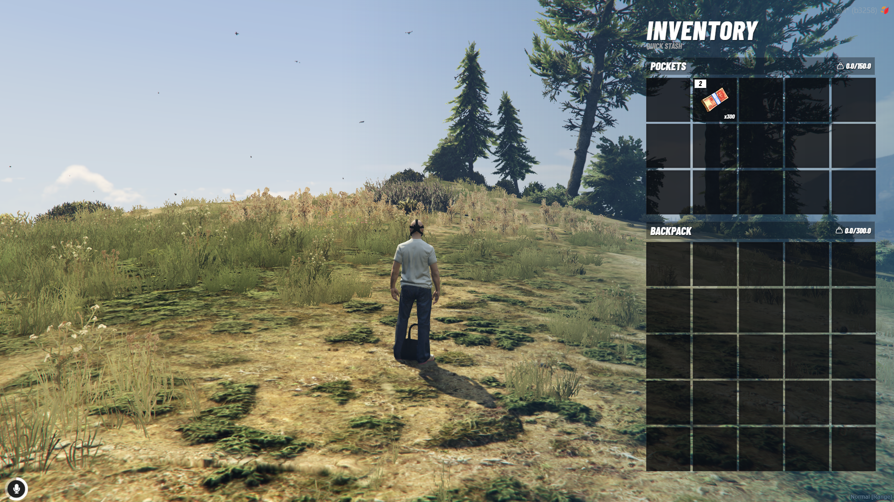
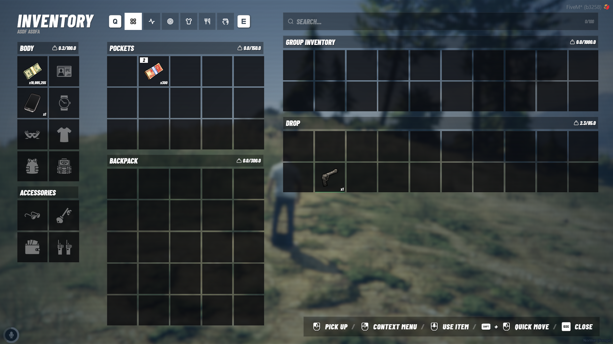

# NoPixel Inspired Inventory (`ox_inventory`)

Slot-based FiveM inventory with item metadata, redesigned for a **NoPixel-style** full stash and **Z** quick stash.

Redesign by **Haaasib**. Full credit to **[Overextended](https://github.com/overextended/)** for the original `ox_inventory`, and **[Community Ox](https://github.com/communityox)** for the maintained fork.

---

## Previews




---

## Quick Install

See the official install guide here: [https://overextended.dev/docs/ox_inventory](https://overextended.dev/docs/ox_inventory)

**UI source** lives in `/web` (React + TypeScript). Edit, then rebuild:

```bash
cd web
npm i
npm run build
```

---

## Features

- Full inventory: body, accessories, pockets, backpack, group inventory, and drop grid
- Quick stash on **Z** (right-side panel, no full-screen overlay)
- Search, Q/E category filters
- Drop from quick stash without opening the full inventory

---

## Credits

- **[Overextended](https://github.com/overextended/ox_inventory)** — original ox_inventory
- **[Community Ox](https://github.com/communityox/ox_inventory)** — community-maintained fork
- Docs: [https://coxdocs.dev](https://coxdocs.dev)

---

## Links

- **Discord Support**: [https://discord.gg/kj3bWdD7uK](https://discord.gg/kj3bWdD7uK)
- **Store**: [https://tebex.haaasib.dev/](https://tebex.haaasib.dev/)
- **Overextended**: [https://github.com/overextended](https://github.com/overextended)
- **Community Ox**: [https://github.com/communityox](https://github.com/communityox)
